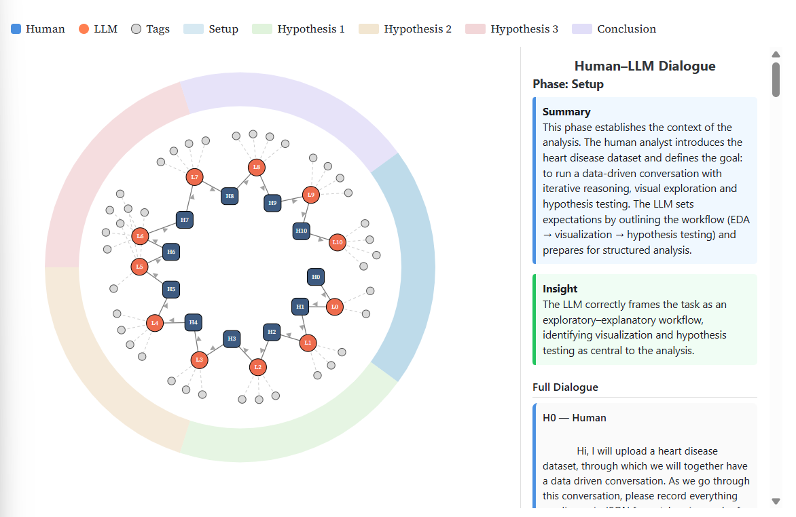
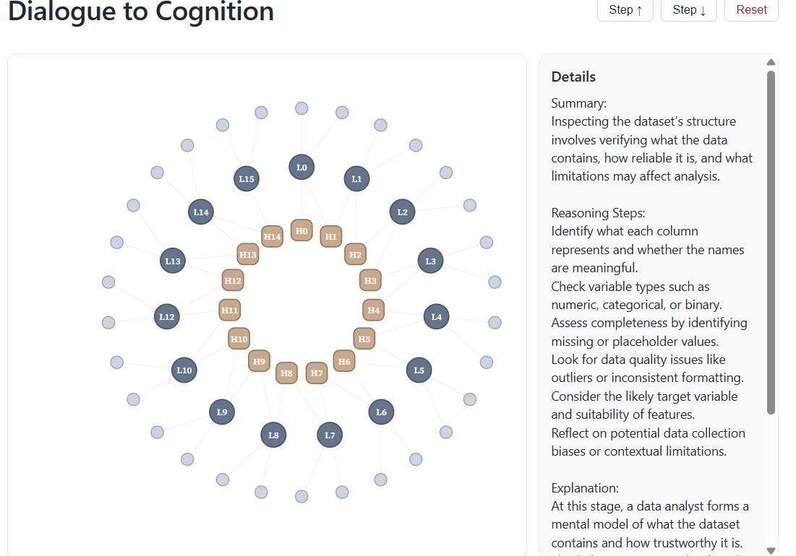

# From Dialogue to Diagram

### Structuring and Visualising Data Analysis with Large Language Models

This project investigates how Human–LLM data analysis conversations can be transformed into structured visual representations that make analytical reasoning easier to inspect.

The framework separates an LLM interaction into two layers:

- **Behavioural layer** — what the LLM actually says and does during the analytical conversation.
- **Cognitive layer** — a structured, self-reported representation of the reasoning steps, summaries, explanations and intended next actions.

These layers are converted into graph structures and compared to investigate alignment, reasoning drift, omissions and differences between intended and observed analytical behaviour.

## Problem

Human–LLM analytical conversations are usually presented as long linear chat logs, making it difficult to inspect how an analysis develops, whether planned analytical steps are actually followed, and where reasoning may diverge or drift.

This project addresses that problem by converting analytical conversations into structured visual representations that make the relationship between an LLM's **self-reported reasoning** and its **observable behaviour** easier to inspect.

## Method

The project uses a dual-layer framework to compare how an LLM describes its analytical reasoning with what it actually does during a Human–LLM data analysis conversation.

The workflow involved:

- Collecting analytical conversations across **Heart Disease, UK House Price Index and CO₂ emissions** use cases.
- Structuring conversation turns using **JSON-based logging**.
- Creating a **behavioural layer** representing the observable analytical conversation.
- Creating a **cognitive layer** representing the LLM's structured self-reported reasoning.
- Processing and cleaning the logs in **Python**.
- Converting the processed data into **node-link graph structures**.
- Visualising the graphs interactively using **Observable and D3.js**.
- Evaluating alignment using **semantic, structural and analytical completeness** measures.

The Heart Disease case study was used as the primary dual-layer evaluation case.

## Project Pipeline

Raw Human–LLM Conversations  
→ JSON Extraction & Cleaning  
→ Cognitive and Behavioural Graph Construction  
→ Interactive Visualisation  
→ Alignment & Divergence Evaluation

## Visualisations

### Behavioural Graph Interface

### Cognitive Graph

## Key Results

Using the Heart Disease analysis as the main evaluated case study:

- Most cognitive reasoning nodes showed **90–100% semantic alignment** with the corresponding behavioural output.
- Despite the high overall alignment, the analysis revealed **localised divergence** between stated reasoning and observed behaviour.
- Divergence appeared through **expansion, compression and omission** of analytical steps.
- The visual comparison helped identify examples of **reasoning drift**, showing that the LLM's stated analytical plan acted more like a flexible guide than a strict execution sequence.

## Limitations

- The full dual-layer evaluation was conducted only on the **Heart Disease** case study, so results may differ across other domains, tasks or prompting styles.
- The cognitive layer is based on **LLM self-reported reasoning** and should not be treated as direct access to the model's hidden internal computation.
- The semantic alignment process uses manually defined verb and noun groupings, which introduces some **human judgement** into the evaluation.
- The current diagrams show reasoning structure, but do not represent **uncertainty, confidence or probability**.

## Technologies

- Python
- JSON
- NLTK
- JavaScript
- D3.js
- Observable
- Jupyter Notebook
- Visual Analytics

## Repository Structure

- `notebooks/01_data_cleaning.ipynb` — cleans and structures the raw Human–LLM conversation logs.
- `notebooks/02_evaluation.ipynb` — evaluates alignment between the cognitive and behavioural reasoning representations.
- `data/raw/` — contains the original Human–LLM conversation logs used in the project.
- `data/processed/` — contains cleaned JSON graph data used for visualisation and evaluation.

## How to Run

1. Clone or download this repository.
2. Open the notebooks in Jupyter Notebook or JupyterLab.
3. Run `notebooks/01_data_cleaning.ipynb` to process the raw conversation logs.
4. Run `notebooks/02_evaluation.ipynb` to evaluate alignment between the cognitive and behavioural graph structures.
5. Explore the interactive visualisation using the Observable link below.

## Interactive Visualisation

An interactive version of the graph visualisation is available on Observable.

https://observablehq.com/@rakeens-workplace/from-dialogue-to-diagram-structuring-and-visualizi

## MSc Data Science Dissertation

City St George's, University of London  
MSc Data Science, 2024–2026
